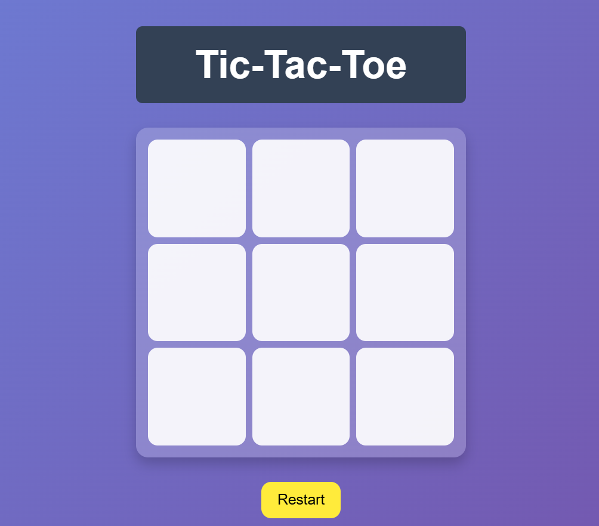
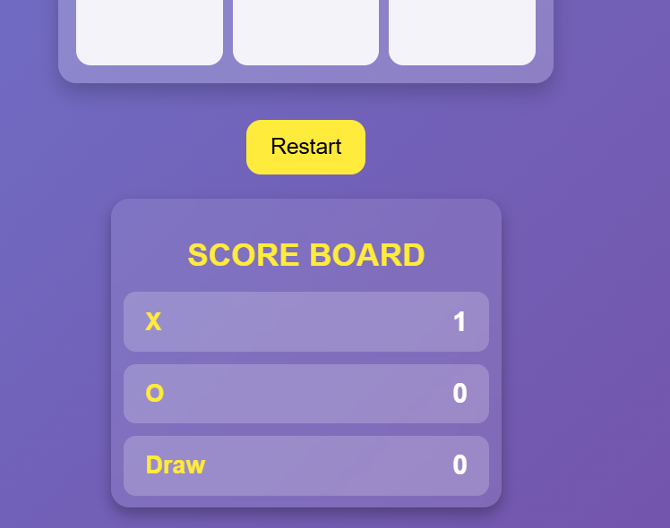
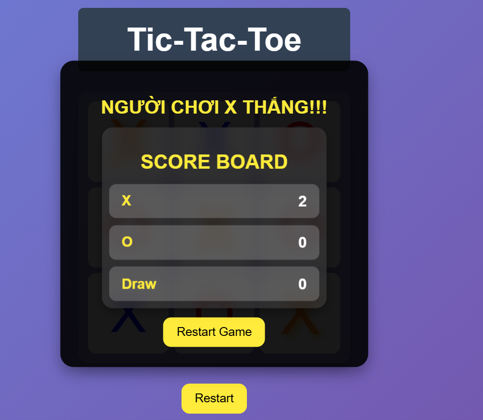
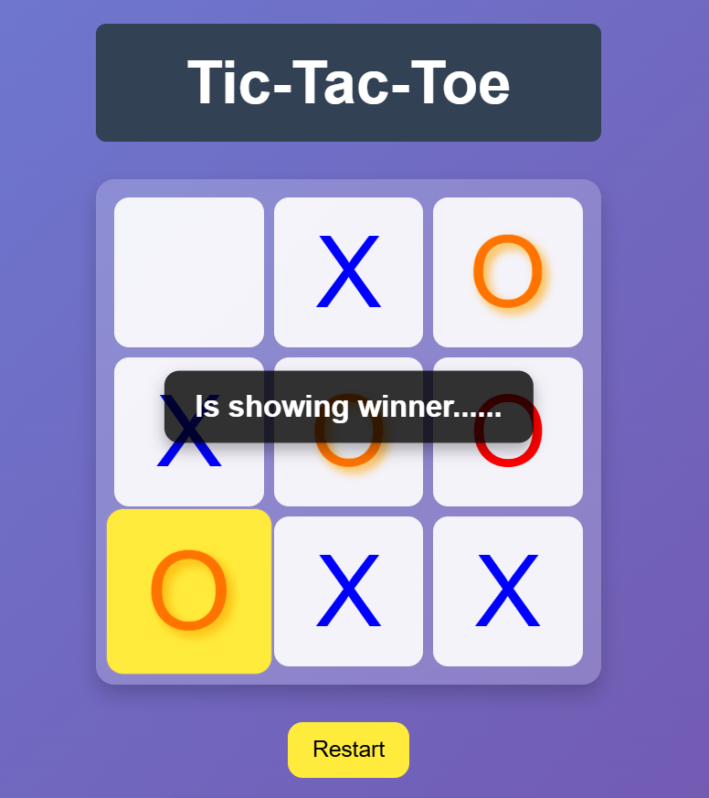

# Tic-Tac-Toe

Người thực hiện 
Lê Tấn Khang
SĐT 0788949502
Gmail: khang1512.it2001@gmail.com
Git: khangleit

## Giới thiệu
Đây là một trò chơi Tic-Tac-Toe (cờ ca-rô) được xây dựng bằng ReactJS Stypescript. Người chơi có thể chơi trên giao diện web với chế độ hai người chơi.

## Công nghệ sử dụng
- ReactJS
- TypeScript 
- CSS Thuần
- Vite

## Cài đặt và chạy dự án
### 1. Clone repository
```sh
git clone https://github.com/KhangLeIT/tic-tac-toe.git
cd tic-tac-toe
```

### 2. Cài đặt dependencies
```sh
npm install
```

### 3. Chạy ứng dụng
```sh
npm run dev
```
Sau đó, mở trình duyệt và truy cập `http://localhost:5173/`.

## Cấu trúc thư mục
```
.
├── src
│   ├── assets       # Chứa các hình ảnh, logo,...
│   ├── components   # Chứa các thành phần giao diện (Board, Header,ScoreBoard ,Square)
│   ├── App.tsx      # Thành phần chính của ứng dụng
│   ├── main.tsx     # Điểm vào của ứng dụng
│   └── index.css    # Chứa css thuần của website
├── public           # Chứa các tài nguyên tĩnh
├── package.json     # Thông tin dự án và dependencies
└── README.md        # Tài liệu hướng dẫn
```

## Hướng dẫn chơi
1. Mở ứng dụng trên trình duyệt.
2. Trò chơi có hai người chơi, lần lượt chọn các ô trên bảng.
3. Người thắng cuộc là người có 3 ô liên tiếp theo hàng ngang, hàng dọc hoặc đường chéo.
4. Nếu bảng đầy mà không có ai thắng, trò chơi sẽ kết thúc với kết quả hòa.

## Tùy chỉnh
- Có thể chỉnh sửa giao diện bằng cách cập nhật các thành phần trong thư mục `components`.
- Có thể chỉnh sửa giao diện css trong phần `index.css`.

## Đóng góp
Đây là phần kiểm tra bài test của Lê Tấn Khang.

## Giao diện chính
Các hình ảnh





